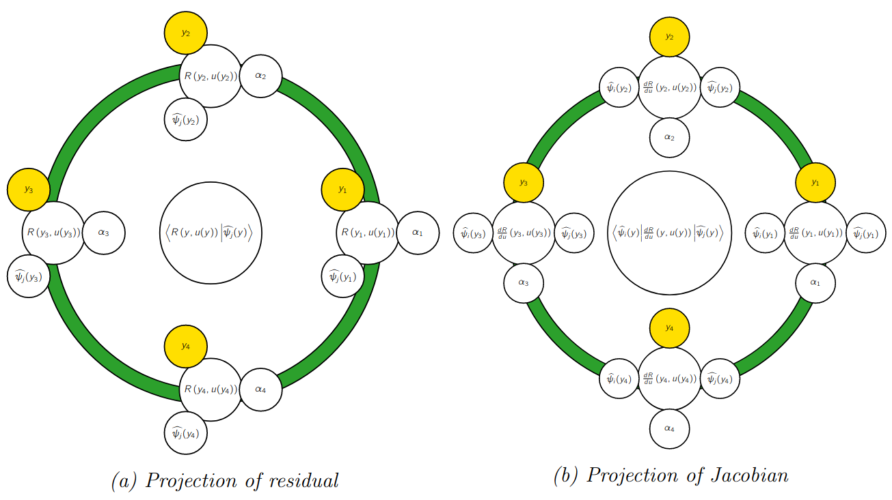
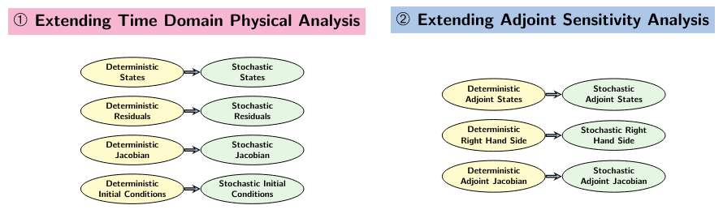
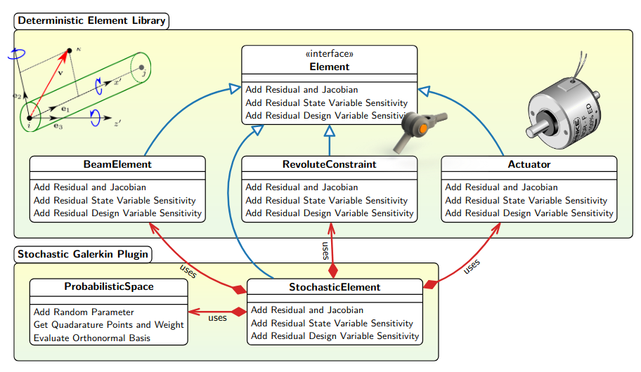
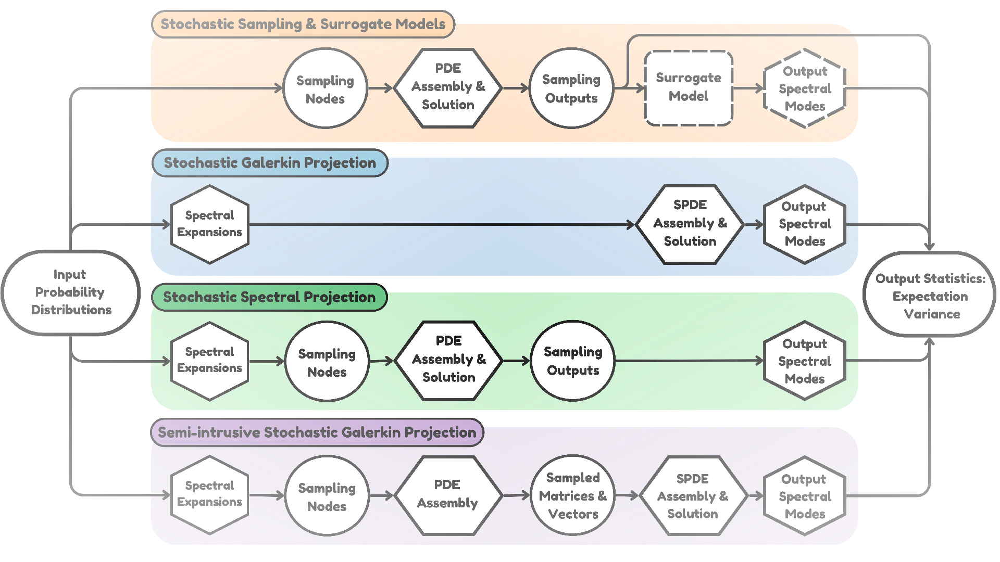

We summarize our contributions in the context of *Computational Methods for Physics Informed Aerospace Design Optimization Under Uncertainties*

---

### Semi Intrusive Stochastic Galerkin Finite Element and Adjoint Method for Propagating Uncertainties through Stochastic PDEs

We have invented a novel method for uncertainty propagation, which proposes to implement sampling around the modules that evaluate residuals vectors and Jacobian matrices in computational physics frameworks.

<b>Figure:</b> The applied conceptual framework for a probablistic sampling based stochastic Galerkin implementation.

Our approach stands out from the classical sampling-based approaches that implement sampling around output quantities of PDEs to compute their statistics, and the Galerkin projection method that requires an end-to-end intrusive implementation. Our approach is to leverage existing deterministic spatio-temporal implementations as is, and structure the probabilistic domain discretization in a standalone module to effectively decouple domain specific discretizations.

The concept of sampling matrices and vectors in block-form or assembled-form to numerically form the stochastic Galerkin system of vectors and matrices extends naturally to adjoint derivative modules. We have successfully demonstrated the implementation of Stochastic Galerkin method for physics and adjoint in the context of general purpose flexible multibody dynamics and finite element framework, and used it to solve optimization under uncertainty problems.

Our work resolves the long-standing issue of intrusiveness concerning the classical Stochastic Galerkin method, by contributing a variant referred to as the **semi-intrusive stochastic Galerkin method**, evolved through a surgical application of sampling for the decomposition of stochastic modes.

---

### Adjoint-Enabled Design Optimization Under Uncertainty Framework and Applications

We have contributed an unified design optimization under uncertainty framework that provides adjoint gradients of the statistics.

> implements several methods for the propagation of uncertainties as shown in Figure. These are based on time dependent finite element analysis along with discrete adjoint-based gradients necessary for OUU applications.

> The framework has been applied to demonstrate OUU on aerodynamic shape optimization, flexible multibody systems such as robotic arms.

<b>Figure:</b> (1), (3), (4) are the easy to implement sampling-based methods for the propagation of uncertainties through computational physics frameworks.

### Scalable Rotorcraft Design Optimization Using Discrete Adjoint Sensitivities

> We have contributed time-dependent discrete adjoint sensitivities for second-order systems for multi-step and multistage time-integration schemes. These schemes have been implemented as a part of a finite-element based flexible multibody dynamics framework, and used to demostrate adjoint-based optimization of rotorcraft blades.

> The formulations are physics-agnostic due to the use of abstraction and amenable for natural second-order form of equations and thus there is no need to cast the set of equations into first order form. 

### Adaptive Strategy for Surrogate Model Training and Validation

- Dynamic training and validation of surrogate models using models built over the sub-domains of global surrogate models

- Incorporation of gradient and hessian information in training with kriging and polynomial chaos

- Incorporation of low and high-fidelity training data

- Application of surrogate-based OUU framework for robust structural and aerodynamic optimizations

