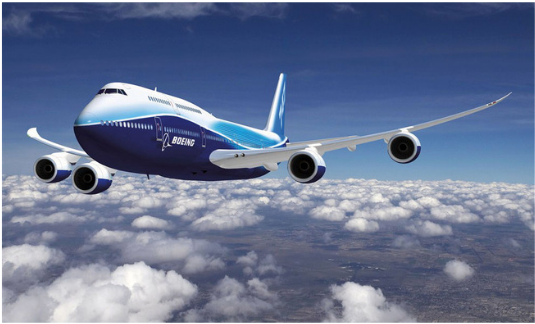
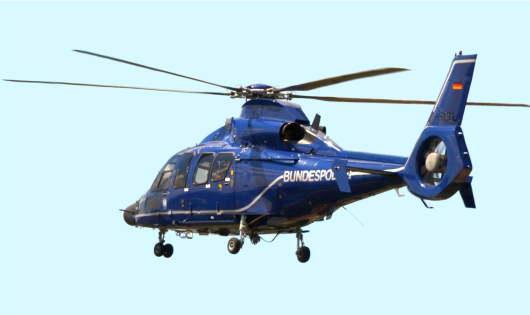
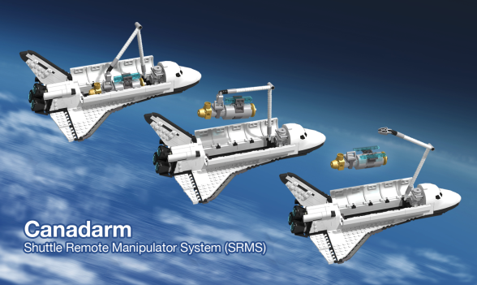
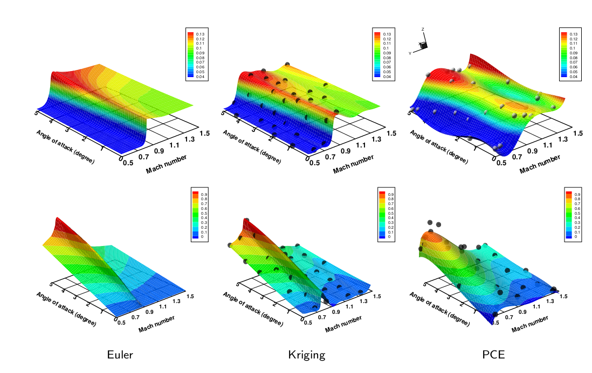

[Curriculum Vitae (PDF)](../files/KomahanBoopathyCV.pdf)

My passion lies in crafting simulation frameworks that model and analyze the equilibrium of aerospace vehicle components with the environmental surroundings, and provide means for design improvement through statistics of quantities of interest and their sensitivities to design variable perturbations. Thus, I undertake as well as take-part in the development of scalable, flexible and robust computational frameworks for scientific computing and targeted applications in aerospace vehicle design contexts such as fixed-wing aircrafts, rotorcrafts and space system robotic arms. 

|  |  |  |
| :--------------------------: | :---------------------------: | :-----------------------------: |
|       Aircraft Design        |       Rotorcraft Design       |      Space Systems Design       |

For more context on the technology and its significance, please read this [post]().

## Current Role

I work as a Senior Research Engineer at ANSYS, focussing on the development activities of the Fluent GPU solver offering [orders of magnitude speed-up, and energy savings](https://www.ansys.com/blog/unleashing-the-full-power-of-gpus-for-ansys-fluent) over classical CPU-based HPC in the context of computational fluid dynamics (CFD) simulations. 

## Graduate Research

I hold a Ph.D. in Aerospace Engineering from the Georgia Institute of Technology. I worked as a research assistant at the [SMDO laboratory](https://gkennedy.gatech.edu/) led by [Prof. Graeme Kennedy](https://scholar.google.com/citations?user=LHqGhxkAAAAJ&hl=en). My research effort was concentrated on the development of a computational [flexible multibody dynamics solver](https://github.com/smdogroup/tacs) with adjoint sensitivity analysis capabilities for the NASA Langley Research Center's [rotorcraft design applications](https://www.youtube.com/watch?v=-HM0KycBvnA). This deterministic computational framework was then naturally extended into an [adjoint-enabled stochastic finite element framework](https://github.com/komahanb/stacs). The latter framework is capable of providing the statistical information on quantities of interest and the adjoint gradient of statistics offering scalability benefits in the context of solving large-scale optimization problems.

I also hold a Master's degree in Aerospace Engineering from the University of Dayton working as a research assistant in [Prof. Markus Rumpfkeil's](https://scholar.google.com/citations?user=zCRdVjYAAAAJ&hl=en) CFD laboratory, where I focused on the development of methods for aerodynamic optimization under uncertainty using surrogate models, and adaptive means for model error-estimation and training-point-selection. For more detailed information, the theses and associated presentations shall be accessed below:

| Degree | Program               | School                          | Year         | Thesis                                                       | Slides                                                       |
| ------ | --------------------- | ------------------------------- | ------------ | ------------------------------------------------------------ | ------------------------------------------------------------ |
| Ph.D   | Aerospace Engineering | Georgia Institute of Technology | 2015 -- 2020 | [Adjoint Based Design Optimization of Systems with Time Dependent Physics and Probabilistically Modeled Uncertainties](http://hdl.handle.net/1853/63658) |  |
| M.S    | Aerospace Engineering | University of Dayton            | 2012 -- 2014 | [Uncertainty Quantification and Optimization Under Uncertainty Using Surrogate Models](http://rave.ohiolink.edu/etdc/view?acc_num=dayton1398302731) |  |
| B.Tech | Aerospace Engineering | SRM University                  | 2008 -- 2012 | --                                                           | --                                                           |
