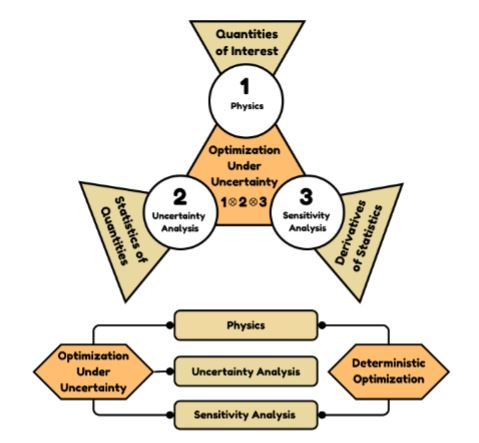

## Computational Methods for Physics Informed Aerospace Design Optimization Under Uncertainties 

## Highlighted Contributions

### (1) Partial Differential Equation Constrained Optimization Under Uncertainty

- Unified OUU framework that implements Stochastic Sampling Method (SSM), Stochastic Projection method (SPM), Stochastic Galerkin Methods (SGM) and the optional use of surrogate models; and the gradients for optimization computed using the adjoint method

- A novel sampling-based architecture that implements popular methods for UQ including the SGM which is known to be intrusive, along with adjoint sensitivity analysis of statistics of the metrics of interest

- The application of SGM in general purpose FEM framework and an end-to-end OUU with adjoint sensitivity analysis of statistical metrics of performance outputs

### (2) Scalable Rotorcraft Design Optimization Method Using Discrete Adjoint Sensitivities

- Finite-element based flexible multibody dynamics framework suitable for multidisciplinary sensitivity analysis of rotorcrafts (contributed to NIA/NASA)  

- Unified implementation of time-marching and adjoint sensitivity analysis methods using implicit multistep and multistage schemes

### (3) Adaptive Strategy for Surrogate Model Training and Validation

- Dynamic training and validation of surrogate models using models built over the sub-domains of global surrogate models

- Incorporation of gradient and hessian information in training with kriging and polynomial chaos

- Incorporation of low and high-fidelity training data

- Application of surrogate-based OUU framework for robust structural and aerodynamic optimizations

