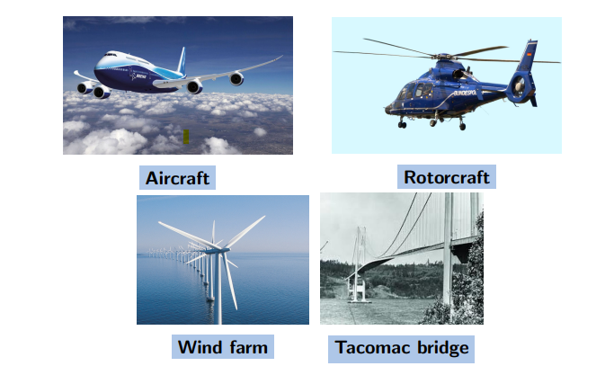
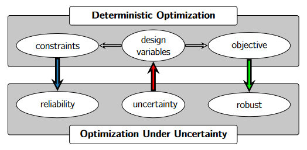
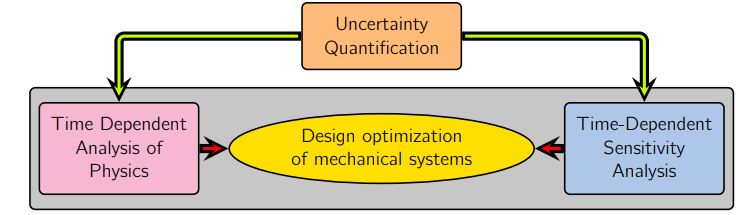
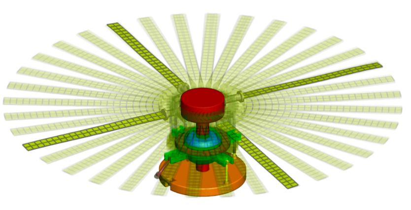
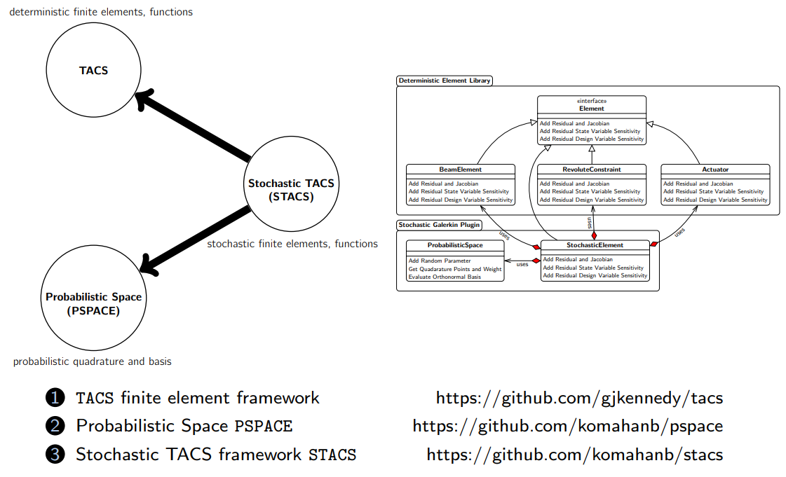
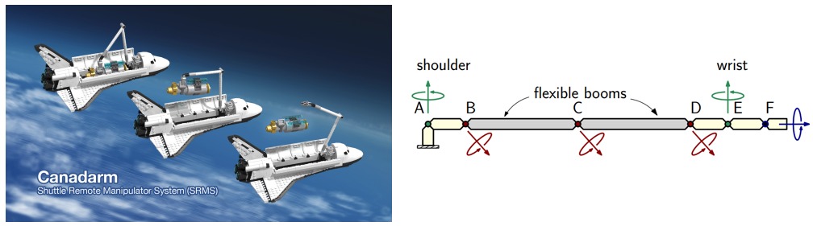
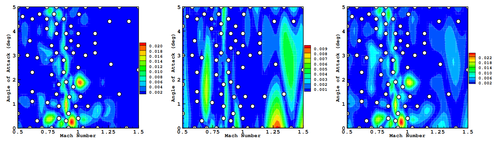
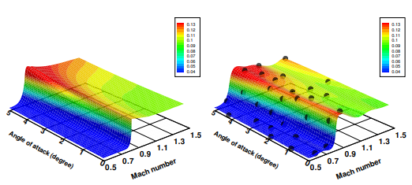
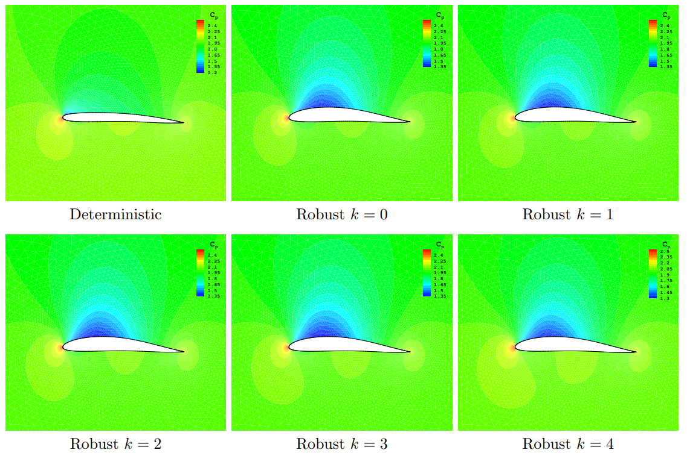

## Journal Articles



    
    

        <h3>{{ count }}. <a href="{{ post.url }}">{{ post.title }}</a></h3>
        
        
        
{{ post.image-caption }}

        
    

    
    


## Conferences Papers



    
    

        <h3>{{ conference_count }}. <a href="{{ post.url }}">{{ post.title }}</a></h3>
        
        
        
{{ post.image-caption }}

        
    

    
    


## Theses

### Adjoint Based Design Optimization of Systems with Time Dependent Physics and Probabilistically Modeled Uncertainties

> #### Ph.D. Dissertation
>
> #### School of Aerospace Engineering, Georgia Institute of Technology, Atlanta, Georgia, 2020
>
> #### DOI http://hdl.handle.net/1853/63658

[PDF](../files/2020-komahan-boopathy-gatech-phd-thesis.pdf) 

[Slides](../files/2020-komahan-boopathy-gatech-phd-thesis-talk.pdf)

#### Summary

<b>Figure:</b> Time dependent physics in aerospace and civil engineering applications. 

For aerospace structures, failure can occur not only because of static adversities like divergence, but also due to time dependent issues like flutter and large vibrations. Therefore, the consideration of time-domain physics becomes essential during design. The physics-based design of aerospace systems involves solving partial differential equations to obtain metrics of interest that guide the design process. These differential equations contain unknown parameters that are sometimes difficult to be characterized as a deterministic value. The uncertainties in input parameters have a direct impact on the output metrics of interest which guide the system design process. To this end, optimization under uncertainty has evolved as a field that accounts for the effect of uncertainties, by propagating the effect of uncertainties through physics simulations. 

<b>Figure:</b> The evolution of optimization under uncertainty from deterministic optimization. 

For numerical optimization, the algorithms that do not use gradient information become computationally intractable as the number of design variables increases. Moreover, the numerical approximations of the gradients through the finite-difference or the complex-step methods are inefficient, for their lack of scalability with respect to the number of design variables. Therefore, efficient gradient evaluation techniques such as the adjoint method are needed for solving large scale optimization problems with practical turnaround times. However, because of the inclusion of time dependent physics, the corresponding time dependent adjoint equations needs to be formulated and implemented. Furthermore, the uncertainties need to be propagated through the time dependent physics and the adjoint sensitivity analysis framework. Due to the inherent complexities in the development of time domain physics and adjoint sensitivities analysis capabilities, the sampling-based methods are widely used for the propagation of uncertainties while the projection-based methods are less used. 

<b>Figure:</b> The propagation of uncertainties through physics and adjoint frameworks.

This work presents enhanced implicit time marching methods for flexible multibody dynamics, to analyze the time dependent behavior of aerospace structures, and formulates the corresponding time dependent adjoint sensitivity analysis equations, to efficiently optimize designs using gradient based methods. The adjoint-based design capabilities are demonstrated with the structural optimization of a rotorcraft hub system. 

<b>Figure:</b> The rotocraft model subject to adjoint based optimization.

A newly developed semi-intrusive approach for projection is shown to fully reuse the underlying time-domain analysis and adjoint sensitivity analysis capabilities, for the projection-based propagation of uncertainties. Using this method, the stochastic residuals and Jacobians are formed implicitly from the deterministic counterparts that have been implemented apriori. 

<b>Computational Framework for UQ-OUU :</b> Open Source Packages.

The application of the semi-intrusive projection method is shown using a flexible robotic manipulator system modeled after the Canadarm. In the presence of uncertainties in the payloads, the Canadarm system experiences stresses that have a large variability. This work demonstrates the use of uncertainty quantification as a valuable tool for assessing the risk associated with such operating conditions.  

<b>Figure:</b> The Canadarm system and its simplified finite element model used for optimization under uncertainty.

---

### Uncertainty Quantification and Optimization Under Uncertainty Using Surrogate Models

> #### Masters Thesis
>
> #### Department of Mechanical and Aerospace Engineering, University of Dayton, Dayton, Ohio, 2014
>
> #### DOI http://rave.ohiolink.edu/etdc/view?acc_num=dayton1398302731
>

[PDF](../files/2014-komahan-boopathy-masters-thesis.pdf)

[Slides](../files/2014-komahan-boopathy-masters-thesis-talk.png)

#### Summary

Surrogate models are widely used as approximations to exact functions that are computationally expensive to evaluate. The choice of model training information and the estimation of the accuracy of surrogate models are major research avenues. In this work, a unified dynamic framework for surrogate model training point selection and error estimation is proposed. Building auxiliary local surrogate models over sub-domains of the global surrogate model forms the basis of the framework. A discrepancy function, defined as the absolute difference between response predictions from global and local surrogate models for randomly chosen test candidates, drives the framework.

The framework preferably evaluates the expensive exact function at locations, where the value of the discrepancy function is high and when a distance-constraint to previously existing training points are satisfied. As a result, the surrogate model is continually refined in regions of higher uncertainty in prediction, and a better spread of training points is also achieved. Unlike most training point selection approaches, the framework addresses surrogate training from two disparate contexts, as training in the presence and absence of derivative information. The local surrogate models use the derivative information when available and affect the framework via the discrepancy function, and helps determine the locations that require derivative information. The benefits of the dynamic training approach are demonstrated with analytical test functions and the construction of a two-dimensional aerodynamic database. The results show that the proposed method improves the convergence monotonicity and produces more accurate surrogate models, when compared to random and quasi-random training point selection strategies.

<b>Figure:</b>The local surrogate model has orders of magnitude higher errors (left) in aerodynamic drag prediction than the main surrogate model error (middle), yet the difference between the two (right) effectively guides the training point selection process by systematically placing training points from the transonic regime of physics with higher nonlinearity in the parameter space.

<b>Figure:</b>The exact drag function (left) and the approximated drag function (right) contructed using a few training points selected dynamically.

The newly introduced discrepancy function is proposed as an approximation to the actual error in the prediction of the surrogate model leading to the quantities: root mean square discrepancy (RMSD) and maximum absolute discrepancy (MAD). The results demonstrate a close agreement of RMSD and MAE with the actual root mean square error (RMSE) and maximum absolute error (MAE), respectively. Therefore, RMSD and MAD are proposed as measures for the accuracy of the surrogate models in applications of practical interest. The benefit of surrogate validation comes without warranting any additional exact function evaluations, which makes the framework computationally viable.

Multivariate interpolation and regression model is employed to build local surrogates, whereas the kriging and polynomial chaos expansions serve as global surrogate models. This demonstrates the applicability of the proposed framework to any surrogate model with an open choice of training data selection.

Finally, the dynamically trained surrogate models are applied to uncertainty quantifications and optimizations under mixed epistemic and aleatory uncertainties (OUU), for structural and aerodynamic test cases. In the OUUs epistemic uncertainties are propagated via box-constrained optimizations, whereas the aleatory uncertainties are propagated via inexpensive sampling of the surrogate models. The structural test cases include designing a three-bar truss and a cantilever beam, whereas the aerodynamic test case involves the robust optimization (lift-constrained drag minimization) of an airfoil under steady flow conditions.  

<b>Figure:</b> The optimized airfoil shapes produced using the developed optimization under uncertainty framework, shows improvement in lift distribution qualities in comparison to the deterministic design. 
