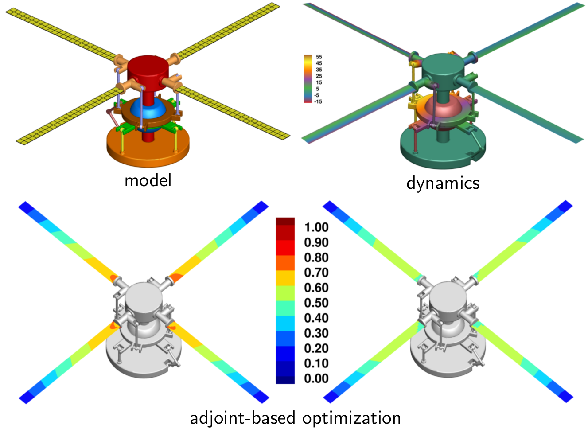

[AIAA Journal](https://arc.aiaa.org/journal/aiaaj); Volume 57; Number 8; 2019; Special Issue on Sensitivity Analysis for Rotorcraft Optimization

[https://arc.aiaa.org/doi/10.2514/1.J056585](https://arc.aiaa.org/doi/10.2514/1.J056585)

A parallel finite-element framework for high-fidelity structural dynamic analysis and discrete gradient evaluation using the adjoint method is presented. The framework is intended to be used for gradient-based design optimization of flexible multibody dynamic systems such as rotorcraft. The formulation of governing equations, numerical treatment of kinematic constraints, and the evaluation of functionals of interest and their derivatives are addressed. A minimal set of routines needed to implement the discrete adjoint method are proposed. The governing equations are integrated in time using a diagonally implicit Runge–Kutta method for second-order systems of equations. The formulation of the corresponding time-dependent discrete adjoint method is presented and is numerically verified using the complex-step method. A verification of the dynamics, an assessment of parallel scalability of the analysis and derivative evaluation techniques, and a demonstration of the design capability are presented.  

<b>Figure: </b> A model helicopter hub assembly is improved by optimally distributing the blade thickness using the adjoint-based optimization methodology.

The hub model parameters for this article were mostly adapted from [The HART-II Test: Rotor Wakes and Aeroacoustics with Higher-Harmonic Pitch Control (HHC) Inputs - The Joint German/French/Dutch/US Project (nasa.gov)](https://rotorcraft.arc.nasa.gov/Publications/../files/Yu_AHSF02.pdf)

<iframe src="/files/2019-rotorcraft-adjoint-optimization-preprint.pdf" width="100%" height="500"  frameborder="yes" border="10" marginwidth="10"  marginheight="10"></iframe>

